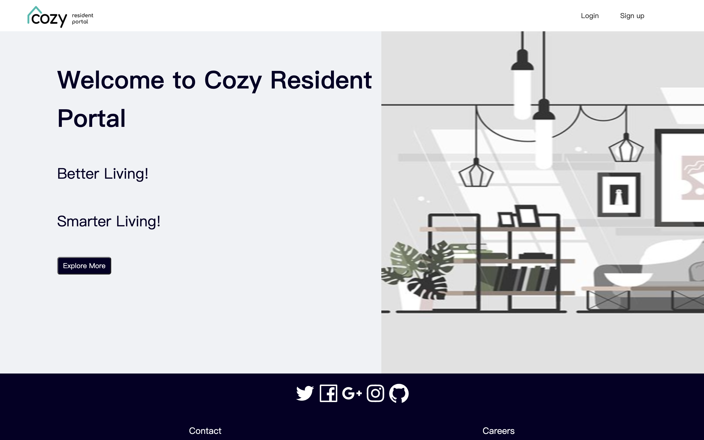
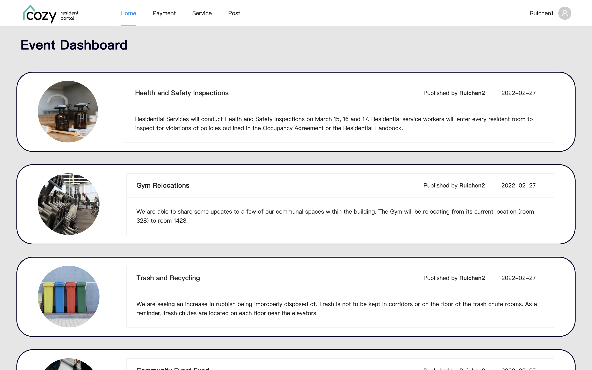
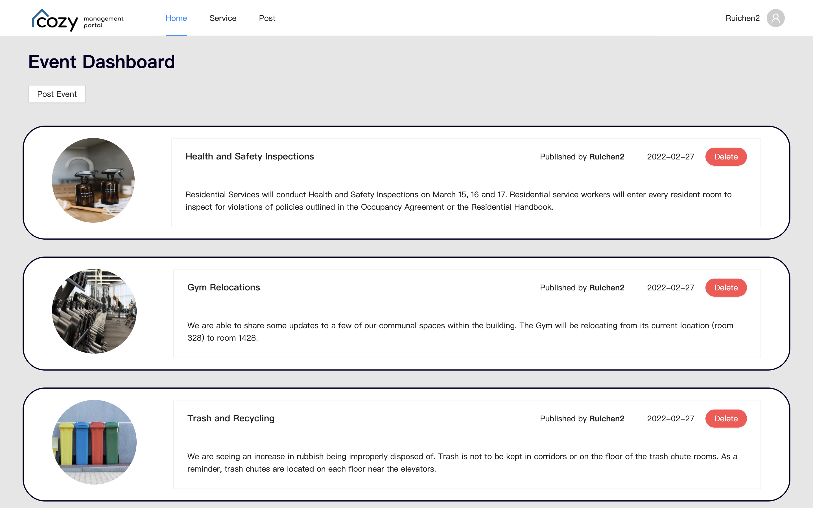
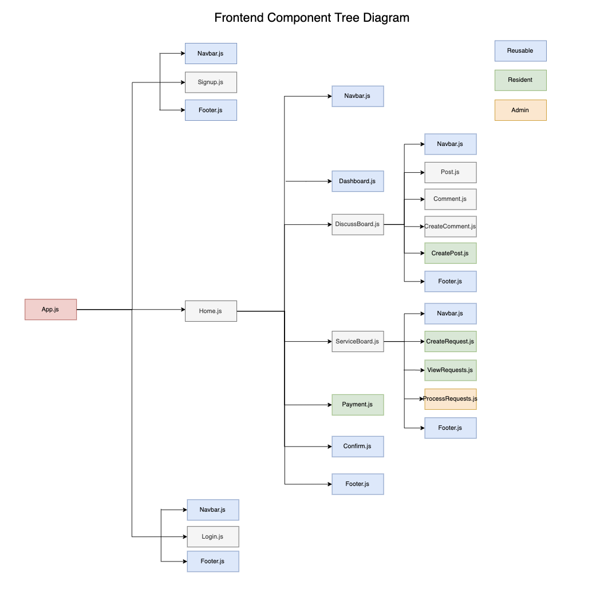
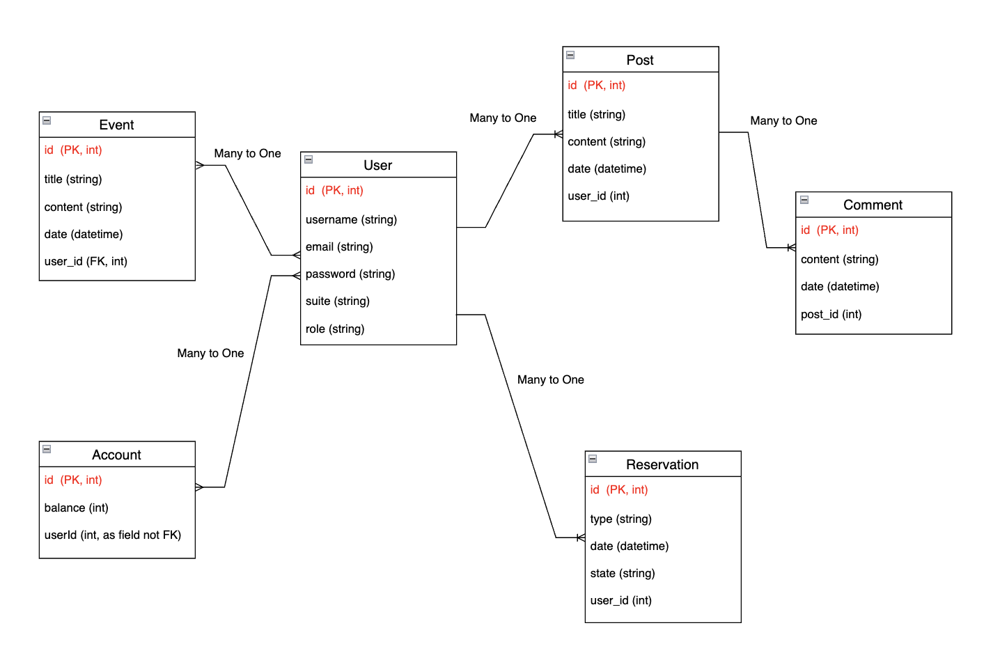

# Cozy

### This is Cozy's frontend repo. See [backend repo](https://github.com/cozy-living/cozy-backend).

## App Description

Cozy is a user-friendly website for managing community properties for residents and trustees. 

 
As a resident, a user can make posts in discussion board, schedule maintenance requests, comment on chat threads, and make regular payments.

 
As an admin, a user can publish news on dashboard, resolve chat threads, and grant or reject maintenance requests.

## Key Features

### 1. Dashboard

A central hub for residents to view upcoming events, alerts, monthly newsletters, and condo policies.

### 2. Discussion Board

A platform for residents to share anecdotes, raise concerns, or report issues, such as a broken light in the lower garage.

### 3. Chat Thread

A comment section for trustees to exchange messages and updates.

### 4. Calendar Schedule

A scheduling tool for booking common areas and reserving maintenance services, such as dumpster cleaning, garage cleaning, fire alarm testing, and elevator inspections.

### 5. Payment Tool

A portal for paying condo fees and common room reservation fees.

## Tech Stack

- Frontend: React, Ant Design
- Backend: Spring Boot
- Database: MySQL, AWS RDS
- Cloud Storage: AWS S3
- Deployment: AWS EC2 (backend), S3 (frontend)

## Component Structure

## Database Schema

## Development Instructions

1. Run `git clone git@github.com:cozy-living/cozy.git` to clone the project to your local machine. If you haven't set up the SSH key already, check out [this link](https://docs.github.com/en/authentication/connecting-to-github-with-ssh).
2. `cd` into the repo you just created, run `git checkout -b [your name]` to create your own branch. Next time you want to switch to a different branch, make sure you've committed all your local changes first, then run `git checkout [branch name]`.
3. After you have made some code changes on your branch, run `git add .`, `git commit -m "your commit message"`, `git push` to commit your change to your remote branch on GitHub. Note that you need to run `git push --set-upstream origin [your branch name]` **the first time** after you created your local branch. Only push codes to GitHub if you make sure that the app is not broken after your latest code change.
4. Regularly push your code to GitHub, and make pull requests from main branch to fetch latest changes.