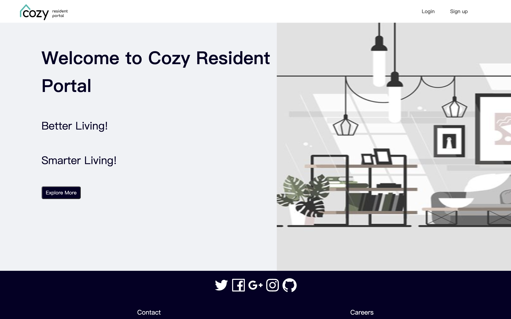
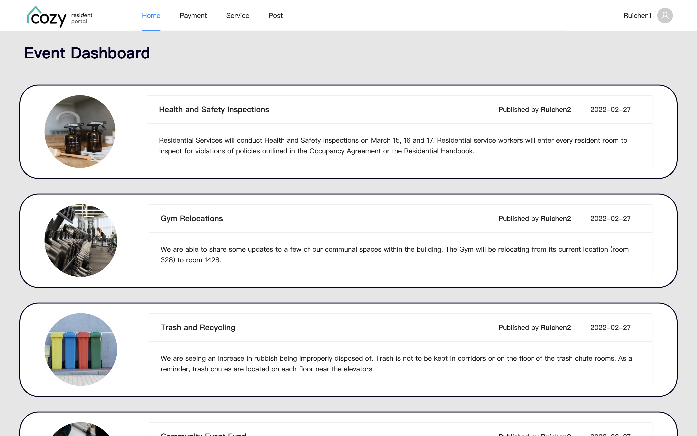

# Cozy

Frontend repository for Cozy. For the backend repository, please refer to [this](https://github.com/cozy-living/cozy-backend) link.

## Description

 

Cozy is a user-friendly website for managing community properties for residents and trustees. 

As a resident, a user can make posts in discussion board, schedule maintenance requests, comment on chat threads, and make regular payments.

As an admin, a user can publish news on dashboard, resolve chat threads, and grant or reject maintenance requests.

## Tech Stack

- Frontend: React, Ant Design
- Backend: Spring Boot
- Database: MySQL, AWS RDS
- Cloud Storage: AWS S3
- Deployment: AWS EC2 (backend), S3 (frontend)

## Main Features

 

1. Dashboard: A central hub for residents to view upcoming events, alerts, monthly newsletters, and condo policies.

2. Discussion Board: A platform for residents to share anecdotes, raise concerns, or report issues, such as a broken light in the lower garage.

3. Chat Thread: A comment section for trustees to exchange messages and updates.

4. Calendar Schedule: A scheduling tool for booking common areas and reserving maintenance services, such as dumpster cleaning, garage cleaning, fire alarm testing, and elevator inspections.

5. Payment: A portal for paying condo fees and common room reservation fees.

## Contributors

- Team Lead: Ruichen
- Tech Lead: Ruichen (backend), Eddy (frontend)
- Frontend: Yong, Hanwen, Yiwen, Hanwei, Shipeng
- Backend: Jianxun, Yutai, Guanxiaoxiong, Xiao, Jiayi
- UI/UX: Yue, Zhiteng
